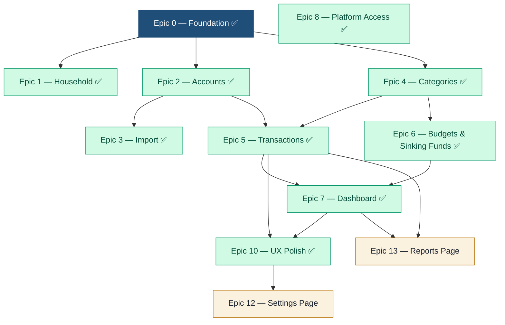

# Personal Finance Manager — Phase 1 Epics & Stories

**Prepared for:** Harsh
**Date:** June 13, 2026
**Version:** 0.3
**Purpose:** Sprint-ready breakdown of Phase 1, structured for **parallel development by multiple people** and clean merging. Stories trace to the Phase 1 PRD (`phase1-spec.md`) and Technical Design (`phase1-technical-design.html`).

---

## 1. How This Is Organized for Parallel Work

Phase 1 is split into one **foundation epic** (the shared kernel everyone builds on) and several **feature epics** that can be developed in parallel once the kernel lands.

**The rule:** the foundation epic (Epic 0) must merge first. It establishes the data model, auth, the visibility/permission helper, the API conventions, and the design system — the shared contracts. After that, feature teams work on separate epics in their own branches against those contracts, stubbing dependencies where needed.

### 1.1 Dependency graph



### 1.2 Suggested parallel waves

| Wave | Epics (parallel) | Notes |
|---|---|---|
| **Wave 1** | Epic 0 ✅ | Foundation — everyone depends on it; land first. |
| **Wave 2** | Epic 1 ✅, Epic 2 ✅, Epic 4 ✅, Epic 8 ✅ | All merged to `main`. |
| **Wave 3** | Epic 3 ✅, Epic 5 ✅, Epic 6 ✅ | Merged to `main`. Epic 9 (BYOK AI) deferred. |
| **Wave 4** | Epic 7 ✅ | Dashboard + reports. Merged to `main`. |
| **Wave 5** | Epic 10 ✅ | UX Polish — all stories done, merged to `main` 2026-06-13. |
| **Wave 6** | **Epic 12** *(active)*, **Epic 13** *(active)* | Full Settings page + Reports page (parallel). |
| **Wave 7** | **Epic 11** *(planned)*, **Epic 9** *(planned)* | Rental Investment Tracking + BYOK AI Categorization. |

> **Phase 1 scope note:** Phase 1 is a **limited-user test release** and is **invitation-only** (Epic 8). Data enters via **document/statement upload (Epic 3) and manual entry (Epic 2) only**. **Plaid live aggregation is deferred to Phase 2** — its stories are listed under Epic 2 as Phase 2 for forward planning, not Phase 1 work. A thin **BYOK AI categorization** slice (Epic 9) is included in Phase 1: households may supply their own LLM provider key; AI is always optional. The broader AI insights platform remains Phase 2.

### 1.3 Working agreements (parallel + merge)

- **One epic = one team = one long-lived feature branch**, with short-lived story branches merged into it via PR.
- **Contracts first.** API request/response shapes and the visibility-scope helper are defined in Epic 0 and treated as stable interfaces. Changes to a shared contract require a cross-team PR review.
- **Stub dependencies.** Teams mock upstream modules (e.g. Transactions stubs Accounts) so no one is blocked; integrate against real modules at the wave boundary.
- **Vertical slices.** Each story includes backend + API + UI where applicable, behind a feature flag if partially complete.
- **Definition of Done:** code + tests, meets acceptance criteria, visibility rules respected, PR reviewed, merged to the epic branch with green CI.

### 1.4 Story conventions

- IDs: `E<epic>.<story>` (e.g. `E2.3`). **PRD ref** links to the spec requirement. **Size:** S / M / L (rough).
- Acceptance criteria (AC) are testable and double as the basis for automated tests.

---

## 2. Epic 0 — Foundation / Shared Kernel

**Goal:** the shared substrate all feature epics build on. **Must merge before Wave 2.** Owned by a lead/platform pair.

- **E0.1 — Project scaffolding & CI/CD.** *(Size: M)*
  - AC: Repo bootstrapped (client + API + DB migrations); local dev runs with one command.
  - AC: CI runs lint + tests on PR; main protected; preview/staging deploy configured.
- **E0.2 — Data model & migrations.** *(PRD: Tech Design §2 · Size: L)*
  - AC: Tables for user, household, membership, account, transaction, category, budget, sinking_fund, category_rule, mfa_method per the ER model.
  - AC: `user` has `name` (required) + optional `date_of_birth` / `locale` / `timezone`; `membership` has `role` + `is_primary_owner`; `account` has its own `currency`; `household` has `base_currency` ∈ {USD, EUR, GBP, INR}.
  - AC: Account scoped to `household_id` + `owner_user_id`; category self-referential; `dedup_hash` on transaction; nullable `tag` field reserved for Phase 2.
- **E0.3 — Authentication.** *(PRD: S-1, S-3 · Size: M)*
  - AC: Email/password/**name** signup, password hashing, email verification, login, session/token issuance + expiry/refresh. (DoB is an optional profile field, not collected at signup.)
- **E0.4 — Mandatory MFA.** *(PRD: S-2 · Size: L)*
  - AC: TOTP (Google Authenticator) and email-code methods; primary + backup; recovery codes generated once.
  - AC: MFA enrollment enforced during onboarding before app access; cannot be disabled (method changeable).
  - AC: Rate-limiting/lockout on failed attempts; recovery via backup/codes.
- **E0.5 — Authorization & visibility helper.** *(PRD: A-4, NFR-2 · Size: L)*
  - AC: A central helper resolves, per request, the viewer's accessible account IDs and field-level rules (shared / private / balance-only).
  - AC: All repository/query methods require the visibility scope as a mandatory parameter; totals computed from the same scope.
  - AC: Unit tests prove no cross-member leakage for each visibility state.
- **E0.6 — Design system / component library.** *(PRD: NFR-1, NFR-6 · Size: M)*
  - AC: Shared tokens (color/typography), base components (nav shell, cards, tables, forms, buttons, charts wrapper), responsive layout, accessibility baseline.
- **E0.7 — API conventions & gateway.** *(Size: S)*
  - AC: Standard error/validation envelope, pagination, auth middleware, rate limiting; documented for all teams.

---

## 3. Epic 1 — Household & Membership  ✅

**Goal:** households can be created and shared with configurable roles. **Depends on:** E0. **Parallel with:** Epics 2, 4.

- **E1.1 — Create household on signup.** *(PRD: H-1 · Size: S)*
  - AC: First user becomes the primary Owner (`role:owner` + `is_primary_owner`); household has name, base currency (USD/EUR/GBP/INR), month-start.
- **E1.2 — Invite member with role.** *(PRD: H-2, H-4 · Size: M)*
  - AC: Invite by email with role (co-owner / member); unique expiring link; pending invites listed; resend/revoke.
- **E1.3 — Accept invite & join.** *(PRD: H-3 · Size: M)*
  - AC: Invitee creates own login (+ MFA via E0.4), joins household, sees shared view per permissions.
  - AC: Email already registered → link to this household after confirmation (one active household per user in Phase 1).
- **E1.4 — Manage roles & remove member.** *(PRD: H-4, H-5 · Size: M)*
  - AC: Owner/co-owner changes a member's role (owner↔member; "co-owner" = `role:owner`, non-primary); removes a member (access revoked immediately; their accounts detached not deleted).
  - AC: Cannot remove/demote the primary owner while they are the sole owner.
- **E1.5 — Household settings.** *(PRD: H-1 · Size: S)*
  - AC: Edit household name, currency, month-start; member list shows roles and last login.

---

## 4. Epic 2 — Accounts & Manual Entry  ✅

**Goal:** account model, manual accounts, and per-account visibility. **Depends on:** E0. **Parallel with:** Epics 1, 4.
**Phase 1 scope.** Plaid live aggregation is **Phase 2** (stories listed at the end for forward planning).

- **E2.1 — Account model.** *(PRD: A-1, A-2 · Size: M)*
  - AC: Account entity scoped to household + owner; supports sources `manual` and `import` (Plaid source added in Phase 2); balance, institution, mask fields; **per-account `currency`** (USD/EUR/GBP/INR, defaults to household base; no FX conversion).
- **E2.2 — Manual account & transactions.** *(PRD: A-2 · Size: M)*
  - AC: Add a manual cash/unsupported account; add/edit transactions by hand.
- **E2.3 — Per-account visibility.** *(PRD: A-3 · Size: M)*
  - AC: Owner sets shared / private / balance-only; only the owner can change; enforced via E0.5; defaults (joint→shared, individual→private).
- **E2.4 — De-duplication.** *(PRD: A-4 · Size: M)*
  - AC: `dedup_hash` (account + date + amount + normalized merchant) skips duplicates across repeat imports; never double-counts.

**Phase 2 (forward planning — not Phase 1 work):**

- **E2.P2a — Plaid Link connect & token exchange.** *(PRD: A-7)* — link_token/public_token exchange; store encrypted access_token; no bank credentials stored.
- **E2.P2b — Initial + delta sync & webhooks.** *(PRD: A-7)* — fetch/enrich/categorize; handle `SYNC_UPDATES_AVAILABLE`, `ITEM_LOGIN_REQUIRED`.
- **E2.P2c — Connection health & re-auth UI.** *(PRD: A-7)*
- **E2.P2d — Joint account de-dup across members.** *(PRD: A-4)* — same joint account linked by two members merged.

---

## 5. Epic 3 — Document Upload & Import  ✅

**Goal:** get transactions in via uploaded statement files with no stored credentials — the main way data enters in Phase 1. **Depends on:** E2 (account model). **Parallel with:** Epics 5, 6. **Priority: high.**

- **E3.1 — Upload & parse.** *(PRD: A-1 · Size: M)*
  - AC: Accept CSV/OFX/QFX to encrypted store; parse rows; report row count. (PDF parsing out of scope.)
- **E3.2 — Account detection & selection.** *(PRD: A-1 · Size: M)*
  - AC: Detect account from header (mask/institution); pre-select target; allow new manual account; **must pick if unmatched** (no silent assignment).
- **E3.3 — Column mapping.** *(PRD: A-1 · Size: M)*
  - AC: Map file columns → Date / Merchant / Amount; remember mapping per source for repeat imports.
- **E3.4 — Enrich, dedup & commit.** *(PRD: A-1 · Size: M)*
  - AC: Enrich/auto-categorize imported rows; skip duplicates via `dedup_hash`; commit and report imported/skipped counts.

---

## 6. Epic 4 — Categories & Sub-categories  ✅

**Goal:** household category structure with safe management. **Depends on:** E0. **Parallel with:** Epics 1, 2.

- **E4.1 — Default categories seed.** *(PRD: C-1 · Size: S)*
  - AC: Sensible defaults seeded per household; protected Income category present.
- **E4.2 — Manage categories.** *(PRD: C-2 · Size: M)*
  - AC: Add, rename, recolor, reorder, delete; reachable from Budgets → Manage categories; system categories protected.
- **E4.3 — Sub-categories.** *(PRD: C-3 · Size: M)*
  - AC: Nest under a parent; roll up to parent (parent total = subs + direct spend); collapsed by default in UI.
- **E4.4 — Income sub-categories.** *(PRD: C-4 · Size: M)*
  - AC: Income supports sub-categories; tracked received vs. expected (not a spend cap); visibility-aware (balance-only rolls up to total without line items).
- **E4.5 — Safe deletion.** *(PRD: C-5 · Size: M)*
  - AC: Deleting a category with transactions prompts reassign/merge; deletion cannot orphan transactions; parent with children prompts handling of children.
- **E4.6 — Recategorize & rules.** *(PRD: C-6 · Size: M)*
  - AC: Change a transaction's category; optionally create a merchant rule that auto-applies going forward.
- **E4.7 — Safe deletion UX: reclassify page.** *(PRD: C-5 · Size: S · Wave 3)*
  - AC: Deleting a category with transactions navigates to `/categories/:id/reclassify` listing all affected transactions; user can individually or bulk-reassign via checkbox + category picker; "Delete category" button unlocks once transaction count reaches 0.
  - AC: Back link returns to Categories page without deleting.
  - No new API endpoints — reuses `GET /transactions?categoryId`, `PATCH /:txId/category`, and `DELETE /categories/:id`.
  - AC: Category picker shows top-level categories by default; expand chevron reveals sub-categories inline.

---

## 7. Epic 5 — Transactions  ✅

**Goal:** view, search, and correct transactions. **Depends on:** E2, E4. **Parallel with:** Epics 3, 6.

- **E5.1 — Transaction list.** *(PRD: D-4 · Size: M)*
  - AC: Visibility-scoped list across accessible accounts; search + filter (date, account, category); pagination.
- **E5.2 — Recategorize from list.** *(PRD: C-6, D-4 · Size: S)*
  - AC: Inline recategorize; optional rule creation (shares logic with E4.6).
- **E5.3 — Reserve-funded payment marking.** *(PRD: B-6 · Size: M · depends on E6.3)*
  - AC: A transaction matching a sinking-fund item is linked and badged ("annual · from reserve"); auto-detected with user confirm/override.

---

## 8. Epic 6 — Budgets & Sinking Funds  ✅

**Goal:** monthly budgets plus amortized annual expenses. **Depends on:** E4. **Parallel with:** Epics 3, 5.

- **E6.1 — Monthly budgets.** *(PRD: B-1 · Size: M)*
  - AC: Set budget per category/sub-category; track spent vs. remaining for current period; sub-budgets roll up to parent.
- **E6.2 — Budget visualization.** *(PRD: B-2 · Size: M)*
  - AC: Bars show magnitude (length ∝ budget) and utilization (fill = spent); near-limit/over states; sub-categories collapsed by default, expand on demand.
- **E6.3 — Sinking funds (amortized).** *(PRD: B-3, B-5 · Size: L)*
  - AC: Mark recurring non-monthly expense (annual/semi/quarterly) as amortized; virtual reserve accrues monthly; actual payment draws from reserve (no budget spike).
  - AC: Reserve progress shown (saved vs. target, next due, behind/ahead); monthly view amortized, yearly view true total; **virtual reserves only**.
  - AC: Method selectable (amortized default vs. actual); mid-year start defaults to gradual catch-up; shortfall flagged if reserve insufficient.
- **E6.4 — Income tracking.** *(PRD: B-4 · Size: S)*
  - AC: Income shows received vs. expected per income (sub-)category; not a spend limit.

> **Note:** the Actual/Smoothed spending toggle (PRD B-7) is **Phase 2** — out of scope here.

---

## 9. Epic 7 — Dashboard & Reports  ✅

**Goal:** the at-a-glance shared view. **Depends on:** E5, E6. **Integrates last (Wave 4).**

- **E7.1 — Dashboard KPIs & view toggle.** *(PRD: D-1, D-2 · Size: M)*
  - AC: KPIs (income, spending, budget remaining); budget vs. actual; household/personal toggle (personal = own accounts only; household respects visibility).
- **E7.2 — Default charts.** *(PRD: D-3 · Size: M)*
  - AC: Spending by category, spending over time (**6-month default**, 3M/6M toggle), income vs. expenses, budget vs. actual; interactive (hover amounts); visibility-aware; show actuals; **currency-aware** (base-currency roll-ups only; non-base accounts in a separate per-currency breakdown, never blended/converted).
  - AC (E7.2b): Clicking a pie slice navigates to TransactionsPage pre-filtered to that category and the current month (`?categoryId=<id>&from=<first-of-month>&to=<today>`); user can adjust the date range; "← Back to Dashboard" breadcrumb present. TransactionsPage reads `categoryId`/`from`/`to` from URL search params as initial filter values. Build in the same story as the chart.
- **E7.3 — Reserve-funded marking on spending-over-time.** *(PRD: B-6 · Size: S)*
  - AC: In the Actual view, the reserve-funded portion of a month is a distinct, labeled segment so the spike is self-explaining.
- **E7.4 — Period comparison report.** *(PRD: D-5 · Size: M)*
  - AC: Compare spending by category across two periods with selectable granularity (month/quarter/year over the prior or year-ago period); show per-category totals + absolute/% change + total row; categories expand to sub-categories; visibility- and currency-aware; savable to dashboard.

> Custom chart builder, net worth charts, and rental cash-flow report are **Phase 2**. The period-comparison report (E7.4) is a fixed report, not the custom builder.

---

## 9a. Epic 8 — Platform Access & Site Admin  ✅  *(added 2026-06-10)*

**Goal:** Phase 1 is **invitation-only** — only people the site admin invites can create an account. Built as a policy toggle that later opens to a household-invites-household **beta**, then **general availability**. **This is platform-level access, distinct from the household *member* invites in Epic 1.** **Depends on:** E0. **Parallel with:** Epics 1, 2, 4 (Wave 2). **Start early — it gates signup.**

- **E8.1 — Registration policy & gated signup.** *(PRD: S-6 · Size: M)*
  - AC: Global `RegistrationPolicy.mode` (`admin_invite` | `beta_invite` | `open`); Phase 1 default `admin_invite`.
  - AC: In `admin_invite`, the signup endpoint requires a valid, unexpired `SignupInvite` for that email, consumed on success; enforced **server-side**; rate-limited. No invite → no account.
  - **Dev gate:** invite/email/MFA enforcement sits behind the `AUTH_GATE` flag (off for local dev, on in prod/CI). The check is always present; the flag only toggles whether it runs. See PRD §3.2 implementation note.
- **E8.2 — Site-admin role & bootstrap.** *(Size: S)*
  - AC: `User.isSiteAdmin`; admin-only guard; **first site admin seeded** (`hksingh@gmail.com`) via migration/seed (no admin exists to invite the first one).
- **E8.3 — Admin area (guarded `/admin`, not a separate app).** *(Size: M)*
  - AC: Site-admin-only routes + API to issue / list / resend / revoke `SignupInvite`s, view pending vs. accepted, basic user list. Requires site-admin **and** MFA; intended behind IAP/IP-allowlist when hosted.
- **E8.4 — Beta & GA policy switches (forward-built).** *(Size: S)*
  - AC: `beta_invite` lets an existing household issue signup-invites with a per-household quota (`issuedByHouseholdId`), reusing the `SignupInvite` flow; `open` requires no invite. Phase 1 ships the toggle + `admin_invite` path; beta/GA are config flips.

## 9b. Epic 9 — BYOK AI Categorization  *(added 2026-06-10)*

**Goal:** let a household supply **their own** AI provider key (Claude / OpenAI / Gemini) and use that LLM to interpret/categorize expenses. **Always optional and feature-flagged** — the app works fully with no key (falls back to rules/uncategorized). **Depends on:** E2, E4. **Parallel with:** Epics 3, 5, 6 (Wave 3). The broader AI insights platform stays **Phase 2**.

- **E9.1 — Provider-agnostic LLM layer.** *(PRD: AI-1 · Size: M)*
  - AC: `@pfm/ai` exposes an `LlmProvider` interface (`categorizeTransaction`, `interpretExpense`) with Anthropic / OpenAI / Google adapters; no provider SDK leaks past the interface.
- **E9.2 — BYOK credential management.** *(PRD: AI-2 · Size: M)*
  - AC: Key stored with **KMS envelope encryption** (ciphertext only), validated on save, **write-only** (surface provider + last-4 + status), rotate/revoke; **per-household**, set by an owner, records who added it. Never logged or returned.
- **E9.3 — Consent & data minimization.** *(PRD: AI-3, NFR-3 · Size: S)*
  - AC: Explicit, revocable consent required before any data leaves the system; send only the normalized merchant (+ amount) — never account numbers, masks, or member identity; provider disclosed in consent copy.
- **E9.4 — Categorization integration & rule caching.** *(PRD: AI-1 · Size: M)*
  - AC: On import (extends E3.4) and as a "suggest category" action (extends E4.6/E5.2), the user's LLM suggests a category; user confirms. On confirm, write a `CategoryRule` so the same merchant is never sent twice. Graceful fallback on missing key / provider error.

---

## 9c. Epic 10 — Dashboard & Transaction UX Polish  ✅  *(added 2026-06-12, merged 2026-06-13)*

**Goal:** bring the Dashboard and Transactions pages fully in line with `docs/wireframes-phase1.html`, introduce a user profile + minimal Settings page (display name → avatar initials), add an uncategorized-transaction badge to the nav, let users exclude individual transactions from all budget/accounting calculations, and harden the import dedup flow. **Depends on:** E5 ✅, E7 ✅. **Wave 5. All stories merged to `main`.**

- **E10.1 — User profile & Settings page.** ✅ *(Size: M)*
  - `User.displayName String?` added (migration). `PATCH /auth/profile` accepts `{ displayName }` and saves it.
  - `/settings` page with Profile section — display-name input, save button, live avatar preview.
  - Avatar badge (user's first initial, blue circle) in NavShell topbar; clicking navigates to `/settings`.
  - Avatar initial derived from `displayName` falling back to first char of email.

- **E10.2 — Dashboard wireframe alignment.** ✅ *(Size: M)*
  - Chart layout: Spending Over Time bar chart on **left**, Spending by Category donut on **right**.
  - KPI cards show trend arrows (▲/▼) with percentage vs. prior calendar month; "No prior data" fallback.
  - Spending by Category: top-4 named categories + "Other". Clicking "Other" drills into top-4 within that group + another "Other". Clicking a category navigates to Transactions filtered by category + current month. Back button returns to top level.
  - Spending Over Time correctly includes uncategorized transactions; `isExcluded=true` and `transfer` kind excluded.

- **E10.3 — Transaction filter & sort UX.** ✅ *(Size: M)*
  - Transactions page defaults to Month-to-Date when no URL params present.
  - MTD / YTD / Custom quick-filter pill group; date range inputs only visible when Custom is active.
  - Category filter replaced by multi-select hierarchical picker: selecting a parent selects all children; partial state shows dash indicator; "All expenses" shortcut; "Clear filter" footer.
  - Sum bar shows **Expenses** and **Income** as separate figures (not combined); excludes `isExcluded` transactions.
  - `categoryIds` URL param (comma-separated) accepted by page and API — used when drilling from Dashboard "Other" group.
  - Column headers "Date" and "Amount" are clickable sort toggles (▼/▲/⇅); default: Date ▼ (newest first).
  - "Needs Review" tab skips date filter so all uncategorized transactions appear regardless of import date.

- **E10.4 — Uncategorized badge on nav.** ✅ *(Size: S)*
  - NavShell nav items support optional `badge?: number` prop; renders small red pill when `> 0`.
  - `AppShell` (extracted into `apps/web/src/components/AppShell.tsx`) fetches uncategorized count at app-shell level; wired to Transactions nav item; persists across page navigation.

- **E10.5 — Exclude transaction from calculations.** ✅ *(Size: M)*
  - `Transaction.isExcluded Boolean @default(false)` added (migration).
  - `PATCH /households/{hid}/transactions/{id}/exclude` accepts `{ isExcluded: boolean }`, writes audit record.
  - All financial aggregations (`getSummary`, `getSpendingByCategory`, `getSpendingOverTime`, `totalAmountMinor`) filter out `isExcluded = true`.
  - "Exclude from budgets & reports" toggle in the recategorize panel.
  - Excluded transactions show ⊘ icon and strikethrough amount in the transaction list.

- **E10.6 — Account editing & dynamic balance.** ✅ *(Size: M)*
  - Accounts page: edit button per account; edit form covers name, type, institution, last-4, opening balance, and balance-as-of date.
  - Balance is now **dynamically computed**: `displayedBalance = openingBalance + SUM(transactions WHERE postedDate ≥ balanceAsOf)`. The `balanceMinor` DB field is now the opening balance; incremental maintenance removed from create/update/delete transaction paths.
  - `Account.balanceAsOf DateTime?` added (migration). Transactions before this date are excluded from balance calculation, allowing users to anchor a balance from a known point in time.
  - `balanceAsOfDate` returned in `AccountResponseSchema`; shown as "· as of Jun 1, 2026" on the account row.

- **E10.7 — Transaction delete.** ✅ *(Size: S)*
  - `DELETE /households/{hid}/transactions/{id}` — deletes splits first (no cascade), then the transaction; writes audit record.
  - Trash icon per row in the transaction list (gray → red on hover); browser confirm dialog before deletion.

- **E10.8 — Import fuzzy-duplicate review flow.** ✅ *(Size: M)*
  - Dedup is now two-stage: exact SHA-256 hash match (fast, silent skip) → fuzzy fallback (same account + date + amount + first word of normalized merchant matches → flagged for user review).
  - Fuzzy matches returned in `ImportCommitResponse.flagged[]` instead of being silently skipped; each entry carries the incoming row and the matched existing transaction's merchant, category, and date.
  - After import, a "Review possible duplicates" panel shows side-by-side transaction cards ("Already recorded" vs "From this import") with checkboxes; user selects which to import, clicks "Import selected" → `POST /import/{batchId}/confirm-flagged`.
  - Review state persisted in `localStorage` under key `pfm_pending_duplicate_review` so the panel survives navigation away from the Accounts page.
  - `merchantNormalized` is now stored on imported transactions (was missing, causing downstream classify mismatch).

---

## 9d. Epic 11 — Rental Investment Tracking  *(planned — Wave 6)*

**Goal:** let households that own rental properties view rental income and expenses separately from personal finances. A Settings toggle controls whether rental appears in the main view or as a dedicated nav section. **Depends on:** E2 ✅, E5 ✅. **Full plan:** `docs/epic-11-rental-investment.md`.

- **E11.1 — Account segment.** *(Size: S)*
  - `AccountSegment { personal rental business }` enum; `Account.segment @default(personal)` (non-breaking migration).
  - Segment shown as badge on account rows; segment picker in add/edit account form.

- **E11.2 — Household rental view preference.** *(Size: S)*
  - `Household.rentalViewMode String @default("blended")` — `blended` | `separate`.
  - `PATCH /households/{id}/preferences` endpoint (audit logged).

- **E11.3 — Settings: Finances section.** *(Size: S)*
  - "Rental investments" radio in `/settings`: "Include in main view" / "Show as separate section".

- **E11.4 — Conditional Rental nav + scoped views.** *(Size: M)*
  - When `rentalViewMode = separate` and at least one rental account exists: "Rental" nav item appears.
  - Main-view queries inject `?segment=personal`; Rental nav routes inject `?segment=rental`.
  - No new page components — same Dashboard/Transactions/Budget pages with segment filter applied.

- **E11.5 (Phase 2) — Rental Property entity.** *(future)*
  - `RentalProperty` model (address, purchase price, units); accounts linked to a property.
  - Per-property P&L, cap rate, cash-on-cash return, NOI on a dedicated `/rental/properties` page.

---

## 9e. Epic 12 — User Account Settings (full `/settings` page)  *(Wave 6 — active)*

**Goal:** complete `/settings` to exactly match wireframe screen "8 · Settings". Epic 10 shipped name-only profile. This epic adds the three remaining functional cards and makes the page fully wire-frame compliant. AI categorization card is Epic 9 scope, shown as a placeholder here. **Depends on:** E0 ✅, E10 ✅.

**Layout (2-column grid, then full-width):**
```
┌──────────────────────────┬──────────────────────────┐
│  Profile                 │  Login & security        │
├──────────────────────────┼──────────────────────────┤
│  Two-factor auth         │  Preferences & data      │
└──────────────────────────┴──────────────────────────┘
┌──────────────────────────────────────────────────────┐
│  AI categorization — placeholder (Epic 9)            │
└──────────────────────────────────────────────────────┘
```

- **E12.1 — Profile card.** *(Size: S)*
  - Full name input (existing). Email shown read-only (no change-email flow in Phase 1 — complex re-verification; defer). Optional DOB field: add `dob DateTime?` to `User` schema (non-breaking migration); surface in profile form + `GET /auth/me` + `PATCH /auth/profile`.
  - AC: Save updates name and/or DOB. Email is display-only.

- **E12.2 — Login & security card.** *(Size: S)*
  - New API: `PATCH /auth/password` — body `{ currentPassword, newPassword (min 12) }`. Service: `argon2.verify` current, update hash, revoke all sessions except current (forces re-login on other devices).
  - UI: Current password + New password + Confirm new password + Update password button.
  - AC: Wrong current → 401 error shown. Mismatch → client-side error. Success → banner, stays logged in.

- **E12.3 — Two-factor auth card.** *(Size: M)*
  - Reads `mfaMethods[]` from `GET /auth/me` (already returned by service; contract needs update to expose it).
  - Shows each confirmed method: icon, label (Google Authenticator / Email code), badge (Active · Primary / Backup), date added. "Manage" button links to existing `/mfa/setup` flow for re-enrollment.
  - "View recovery codes" button: adds `POST /mfa/recovery-codes/regenerate` endpoint — requires current password re-confirmation, invalidates old codes, returns 10 new plaintext codes (shown once). Modal displays codes with copy-all button.
  - Note at bottom: "MFA is required and can't be turned off — only the method can be changed."
  - AC: At least one method always active. Regenerating codes writes audit record.

- **E12.4 — Preferences & data card.** *(Size: S)*
  - **Base currency** selector (USD/EUR/GBP/INR) and **Month starts on** selector (1–28, shown as 1st / 15th / etc.) — both editable, call `PATCH /households/:id` on save. Matches wireframe exactly (not read-only).
  - **Export my data** — calls `GET /user/export` (already exists), downloads JSON.
  - **Delete account** — danger button; confirm dialog requires user to type their email; calls `DELETE /user` (already exists). Blocked with message if user is sole household owner.
  - AC: Currency/month-start changes require owner role; show error if member tries. Export downloads within 5 s. Delete immediately revokes access.

---

## 9f. Epic 13 — Reports page  *(Wave 6 — active)*

**Goal:** build `/reports` matching wireframe screen "10 · Reports" — an explorable chart gallery with interactive controls, a featured spending chart, period comparison, a report library of 5 mini-charts, a custom chart builder, and the ability to save any chart to the main Dashboard. **Depends on:** E5 ✅, E7 ✅.

**What's explicitly out of scope:** "Spending by member" mini-chart (no member-level account tagging yet). Custom chart builder "Build a custom chart" placeholder card in the library is replaced by the full builder section below it.

### New DB: `SavedChart` model
```prisma
model SavedChart {
  id          String   @id @default(cuid())
  householdId String
  creatorId   String
  name        String
  chartType   String   // bar | line | donut | stacked_bar
  measure     String   // spending | income | count
  groupBy     String   // category | merchant | month
  dateRange   String   // 3m | 6m | 12m | ytd
  accountId   String?
  categoryId  String?
  view        String   @default("household")
  isShared    Boolean  @default(false)
  sortOrder   Int      @default(0)
  createdAt   DateTime @default(now())
  updatedAt   DateTime @updatedAt
  household   Household @relation(...)
  creator     User      @relation(...)
  @@index([householdId])
}
```
Add reverse relations on `Household` and `User`. Non-breaking migration.

### New API: `ReportsModule` (`apps/api/src/reports/`)

- **E13.1 — Contracts + DB.** *(Size: S)*
  - `packages/contracts/src/reports.ts` — Zod schemas for all 4 report endpoints + saved-charts CRUD.
  - `SavedChart` Prisma migration (above).

- **E13.2 — Report data endpoints.** *(Size: M)*
  Four new GET endpoints under `/households/:id/reports/`:

  | Endpoint | Params | Returns |
  |---|---|---|
  | `spending-by-category-over-time` | months (3/6/12), view, accountId? | `{ months: string[], categories: { id, name, color, amounts: number[] }[] }` |
  | `period-comparison` | granularity (month/quarter/year), period1, period2 | `{ period1Label, period2Label, rows: { categoryId, name, period1Minor, period2Minor, deltaMinor, deltaPct }[], totals }` |
  | `top-merchants` | months, view, limit (default 10) | `{ merchants: { name, amountMinor, count }[] }` — aggregated by `merchantNormalized` |
  | `net-worth-trend` | months (6/12) | `{ points: { month, netWorthMinor }[] }` — computed from opening balances + cumulative ledger |

  All enforce visibility via `buildScope()`. All exclude `isExcluded` transactions.

- **E13.3 — Saved-charts CRUD.** *(Size: S)*
  - `GET /households/:id/saved-charts` — returns charts where `isShared=true` OR `creatorId=me`.
  - `POST /households/:id/saved-charts` — create; body validated by `CreateSavedChartSchema`.
  - `DELETE /households/:id/saved-charts/:chartId` — owner or household owner can delete.

- **E13.4 — Reports UI.** *(Size: L)*
  New file: `apps/web/src/pages/ReportsPage.tsx`.

  **1. Controls bar** (card row) — Period selector (Last 3M / 6M / This year / Custom), Household/Personal toggle, Account dropdown, Category dropdown. Shared state flows to all charts on the page.

  **2. Featured chart — "Spending by category over time"** — calls `spending-by-category-over-time`. Toggle: Stacked bar (one `Bar` per category with `stackId`) ↔ Line (`TrendLineChart` with one line per category). Uses category colors.

  **3. Period comparison** — Month vs month / Quarter vs quarter / Year vs year tabs. Two period dropdowns. Table: Category | Period 1 | Period 2 | Change (colored ▲/▼). Total row.

  **4. Report library** (3-col grid, 5 cards) — each has a small chart (h=130) + title + ★ save button. ★ opens save dialog (name input + share toggle) → `POST /saved-charts`.

  | Card | Data | Chart component |
  |---|---|---|
  | Income vs. expenses | `spending-over-time` | `SpendBarChart` |
  | Net worth trend | `net-worth-trend` | `TrendLineChart` |
  | Cash flow | `spending-over-time` (income − spending) | `SpendBarChart` |
  | Top merchants | `top-merchants` | `SpendBarChart` |
  | + Placeholder | — | Dashed card (links to builder below) |

  **5. Custom chart builder** (2-col: form left, preview right):
  - Form: Measure (Amount spent / Income / Count), Group by (Category / Merchant / Month), Chart type (Bar / Line / Donut / Stacked bar), Date range, Account filter, Share with household checkbox.
  - Preview button → calls the appropriate endpoint based on form state and renders the selected chart type.
  - "Save to dashboard" button → `POST /saved-charts` with full config.

- **E13.5 — Dashboard: saved charts section.** *(Size: S)*
  - `DashboardPage.tsx`: add `GET /saved-charts` query. Below existing Row 2, render a "Saved charts" section (only if `savedCharts.length > 0`) — same 2-col grid, each card renders the saved config using the same report endpoints + chart components. × button → `DELETE /saved-charts/:id`.
  - Add `/reports` route to `App.tsx` and verify Reports nav item in `NavShell`.

- **E13.6 — Configurable category selection for Spending-by-Category chart.** *(Size: M)*
  - Users can choose which top-level expense categories appear as named series on the "Spending by category over time" chart; all others are rolled into an implicit "Other" bar.
  - Selection applies only to top-level categories (never subcategories). "Transfer" is always excluded from both the picker and the chart.
  - AC: A gear icon (⚙) appears in the chart card header; clicking it opens a popover with checkboxes for every top-level expense category.
  - AC: On first open the currently-visible categories (returned by the API) are pre-checked.
  - AC: Clicking Apply refetches the chart with the chosen categories as explicit named bars.
  - AC: Selection persists across page reloads (stored in `localStorage`, keyed by household ID).
  - AC: Selecting zero categories is blocked (Apply button disabled).
  - AC: When all categories are selected, no "Other" bar is shown.
  - AC: Stale `localStorage` IDs (e.g. a deleted category) are silently ignored by the server — that category's spend flows into "Other".
  - API: `GET .../spending-by-category-over-time` gains an optional `categoryIds` query param (comma-separated IDs). When omitted, falls back to the existing top-4-by-spend logic (no breaking change).
  - No DB migration required; preference stored client-side only in Phase 1.

---

## 10. Cross-Cutting Requirements (apply to every epic)

- **Visibility:** every data read goes through the E0.5 scope helper. No endpoint bypasses it.
- **Security:** encryption in transit/at rest; no bank credentials stored; audit sensitive actions (member/role/visibility changes, exports).
- **Privacy:** data export & deletion supported (foundational).
- **Testing:** unit + integration tests per story; visibility leakage tests are mandatory for any endpoint returning account/transaction data.
- **Accessibility & responsive:** all UI meets the E0.6 baseline.

---

## 11. Phase 1 Definition of Done (rollup)

All epics complete and integrated such that the [PRD §7 acceptance checklist] passes: a two-person household can sign up with MFA, invite a partner with a role, add accounts by uploading statements and/or manual entry with visibility controls, manage categories/sub-categories, run budgets with sub-categories and a sinking fund, and view an accurate shared dashboard with the household/personal toggle and default charts — securely on the responsive web app.

**Current status (2026-06-14):** Epics 0–8, 10 are merged to `main`. **Active: Epic 12 (Settings) + Epic 13 (Reports) — Wave 6.** Epic 9 (BYOK AI) and Epic 11 (Rental Investment) are planned for Wave 7. The core Phase 1 user journey is fully functional end-to-end on `main`.
